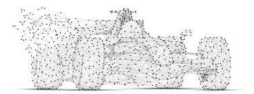
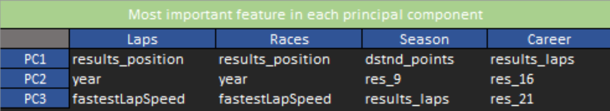
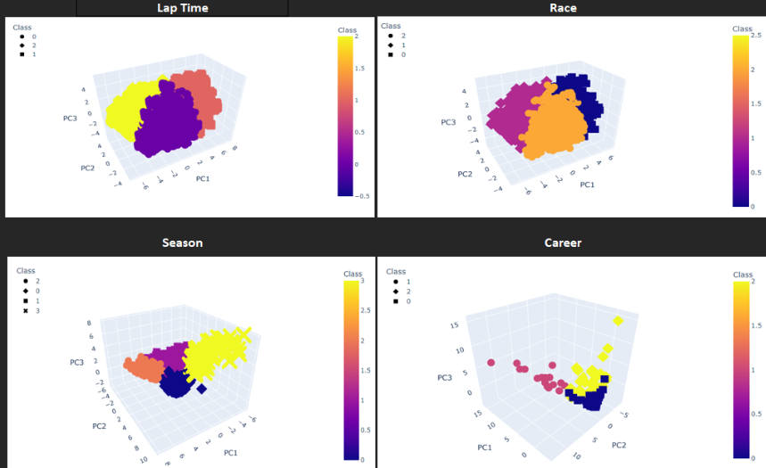
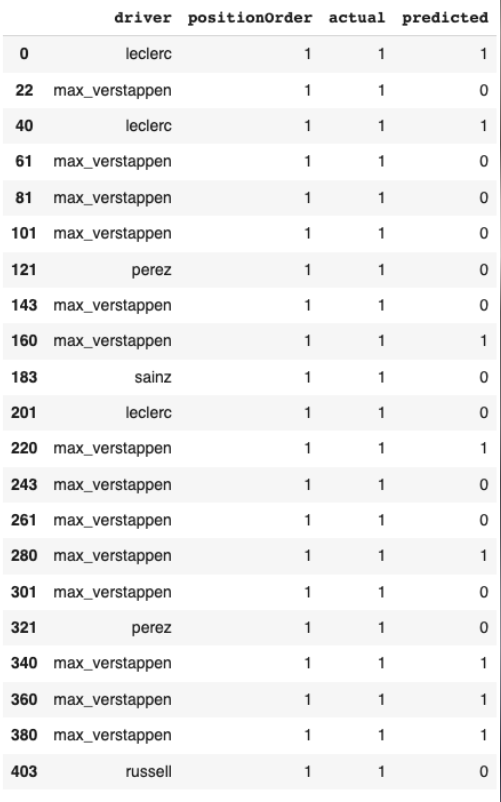
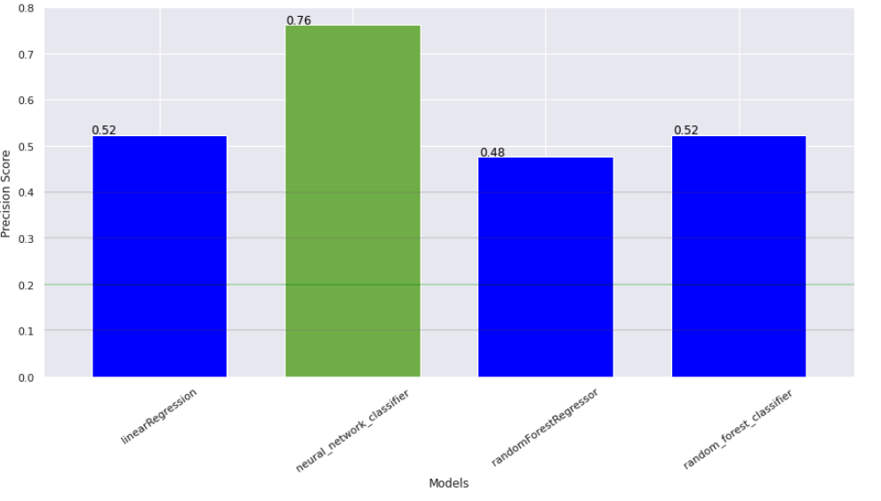
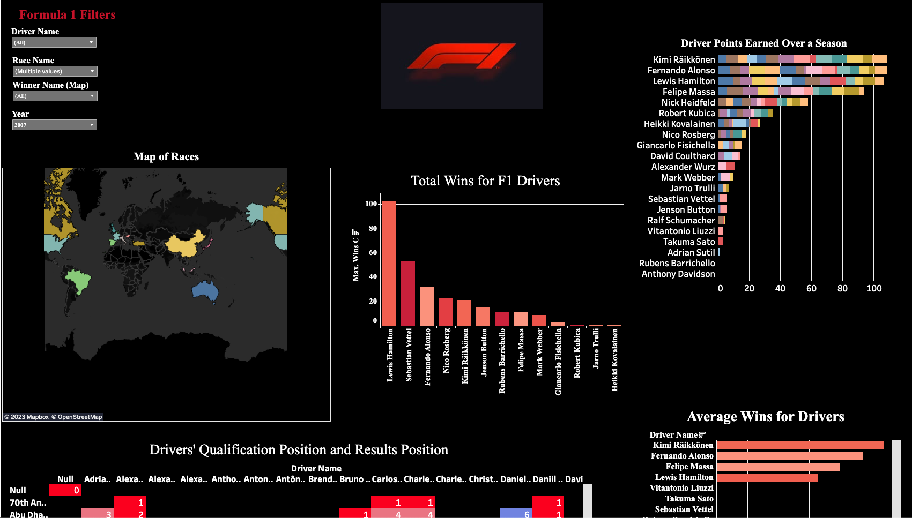

# Machine Learning with Formula 1 Driver Info Analysis
Using ETL, Unsupervised Machine Learning, and creating a visualization dashboard of data derived from Formula 1 Driver information to explore phenomenas within Formula 1.  

 

Jameson Thornton, Varun Yalaka, John Allen, Maher Abdallah, Jacob Voyce, and Tyrone Fraley 
UC Berkley Extension 
Feb 7, 2023 

 

  

 

## Project Overview

 
Stretching back as far as 1946, (ESPN, N.D.); Formula One has been a single-seater racing phenomenon, with an average of 1.21 million viewers per race amongst ESPN, ESPN 2, and ABC platforms in 2021, (The Athletic Staff, 2022).Formula One leaves many fans at the edge of their seats. A whole world of viewers from all different countries, ethnical origins, and cultures united in a front to support the racing league and it's competitors. With such high stakes on the line for each driver/team including, but not limited to: technological racing enhancements rooted in prototypes, team sales growth, winning tournaments, and the safety of the drivers and the crew all on the line in an energy packed race to the finish. The average cost of a Formula One vehicle is "20.62 million", according to de Artola (N.D.).
Knowing this, one may ask themselves if data science could possibly answer questions that not only fans have, but the Formula One teams as well. Such questions  as how race outcomes could be predicted when observing the type of tire compounds vs. pit stops to change the tires, positioning on the starting line and how it could affect a driver's potential to win. Other questions regarding technological enhancements and how they contribute to a driver's capability to increase their performance and what it would look like if all drivers were compared against one another even if they have not faced each other? Questions surrounding the phenomenas might be able to be answered within the realms of Unsupervised Machine Learning. Using historical data derived from Kaggle (https://www.kaggle.com/datasets/rohanrao/formula-1-world-championship-1950-2020), six individuals from different professional backgrounds teamed up to provide the first step to answering: could unsupervised machine learning models be utilized to predict lap times, race results, season/year outomces, and answer the trajectory of the driver's year? Further, what would the produced classifications show about different aspects, experiences, or performances of Formula One drivers from the empirical data set? The team consists of Jameson Thornton, Varun Yalaka, John Allen, Maher Abdallah, Jacob Voyce, and Tyrone Fraley. The team will be using ETL practices through pandas and SQL to first extract and transform the table, store the tables in a SQL DB and AWS, then using pandas ML libraries through sklearn to develop unsuprvised machine learning models. Finally, the data would be visualized with matplot lib, Tableau, and HTML practices to deploy an interactive dashboard of driver data. 
 
  
 
## Collaboration and Assignment of Roles

 
Initially, the team met to observe the raw data and draw possible project outlines to better explore, assess, and visualize the phenomenas presented by Formula One data. Understanding that the initial meeting was crucial to develop a project outline/scope of practice, the team created a vision for the project, team expectations, and overall best practices were established to ensure project deadlines and integrity could be viable. During the data exploration phase, fourteen csv files were compiled into a data frame amassing a total of 449,490 rows to meet saturation for the machine learning model. According to Faulkner, 2017, "Saturation means that a researcher can be reasonably assured that further data collection would yield similar results and serve to confirm emerging themes and conclusions." Amongst the realms of unsupervised machine learning reaching saturation is important. At times when working with machine learning models, one may start out with 1,000 data points and it may go the right direction; however, at times 1,000,000 data points may not be sufficient for the model (Dr. Steeger, N.D.). The next step in the collaboration process was to design an outline of the project, time lines, roles, and deliverables. The outline of the project would include ETL, assign databases using PostgreSQL and AWS, develope an unsupervised machine learning model (K-means clustring), and finally create visualizations using Tableau. The team assignments are listed below; however, at times each team member would volunteer to assist in all roles they were not assigned in an effort to meet project deadlines.

* Project Roles:
    * ETL: Jacob Voyce and Jameson Thornton
    * Database: John Allen
    * Unsupervised/Supervised Machine Learning: Varun Yalaka and Maher Abdallah
    * Visualization: Tyrone Fraley, Jacob Voyce, and John Allen
    * Project Manager: John Allen
    * Technical Written Report: Tyrone Fraley 
    
* Tools:
    * Pandas
    * PostgreSQL
    * Amazon RDS
    * Jupyter Notebook
    * Google Colab
    * Tableau

## ETL

 
The initial phase of the analysis involved implementing ETL (Extract, Transform, Load) procedures using tools such as pandas, PostgreSQL, and Amazon RDS. The process began by extracting data from the Kaggle dataset, subsequently, it was cleaned and transformed using the capabilities of pandas. The cleaned data was then exported as separate data frames in CSV format. These data frames were then imported into 12 tables within Amazon RDS, utilizing PostgreSQL to ensure data integrity and ease of access. Careful execution of each task was crucial to guarantee that the data sets were accurate, dependable, and readily available through the database. Each table was then combined using PostgreSQL to a CSV file called outer_join_final.csv. To ensure this file contained all necessary rows of data the team used outer join functions to prevent rows from being dropped. Once the outer_join_final CSV file was complete the team analyzed it to ensure no rows were dropped and the column values were the correct data types. This file contained all necessary columns to begin the unsupervised machine learning phase.

## Unsupervised Machine Learning Models

 

The objective of this project was to use unsupervised machine learning models to classify Formula One drivers based on various features of driver, constructor, and race data. The team utilized Google Colab as the primary platform for developing and implementing the models, and employed K-means and Hierarchal Clustering Analysis (HCA) algorithms to cluster the data and uncover patterns based on driver performance and race results. K-means was chosen for its ability to handle large data sets, (Google, 2022), while HCA provides a clear data clustering method that creates a dendrogram to help understand the main concepts within the data, (Dotactiv Team, 2020). The team utilized Google Colab to collaborate and share their work easily while having access to powerful tools and resources for machine learning. The goal was to gain new insights into different aspects, experiences, or performances of Formula One drivers by recognizing patterns and trends in the data. The use of K-means and HCA algorithms helped to classify the data into different clusters, and the team also analyzed the elbow curve to determine the optimal number of clusters. Additionally, the team used PCA to support their analysis. Ultimately, the team faced a challenge where the clusters produced by K-means and HCA were closely grouped together, hindering their ability to classify and comprehend the data effectively, which prompted them to also consider using supervised machine learning methods.

 

  

 
 

  

 

## Supervised Machine Learning Models

 

The team launched 4 various supervised machine learning models based on the Formula One data set to analyze driver performance. The models were Linear Regression, Neural Network, Random Forest Regressor, and Random Forest Classifier. From the models the team experimented with different parameters for each model to discover the best results. The results explained that the Neural Network Classifier had the highest precision score of 0.76 while Linear regression had the lowest precision score of 0.52. The precision scores for Random Forest Regressor and Random Forest Classifier were 0.48 and 0.52. It should be noted that the data used left out 2022 data so that we could then discover if the models could predict some 2022 results. This would be later done in Tableau for cross comparison. According to Gad (N.D.), "the precision is calculated as the ratio between the number of Positive samples correctly classified to the total number of samples classified as Positive (either correctly or incorrectly)."

 

  

 
 

  

 

## Visualization in Tableau

 

The team optimized the data in the outer_join_csv for Tableau visualization by streamlining the rows and adding new columns through pandas. The new columns added were driver_country, race_country, avg_lap_time, winner_name, and win_ratio. To minimize duplicate wins in Tableau graphs, the team dropped the lapt_lap and lapt_position columns and transformed the lap_ms column into an average lap time per driver, per race and year. This new column was named avg_lap_time. The driver_country and race_country columns enabled the team to create choropleth maps, which display the winning_name, year, and race_name of a race when the user hovers their cursor over a specific country. These modifications ensured correct visualization of the data in Tableau. The modified data frame would then be exported as a csv called VisualizationDF.

The team utilized Tableau in tandem with Python to develop an HCA model to display the results from the Formula One drivers set. Visualizing the results required the team to use several key features within Tableau, such features as: heat maps, bar charts, and geographical maps. Using these visualizations gave the team the capability of recognizing patterns and trends in the data, and gain insights into different aspects, experiences of performances of the Formula One drivers. For example, the team created bar charts to showcase the average wins per driver, total wins per driver, drivers' qualifying position and results, and points earned by drivers over a season. In addition, a geographical map was created with pop up data capabilities to show the year of a race, the country, the race name, and the winning driver of that race. The graphs, excluding the heat map, were equipped with filters, enabling the end-user to manipulate the data of Formula One and delve deeper into the insights.

To make the results accessible, the Tableau dashboard was then converted into an HTML file, which was displayed on a GitHub web page, providing an easy way for users to view the results. Such usage of Tableau and Python paved the way for the team to create a powerful comprehensible story through visualization to reveal exciting awareness of phenomenas in the Formula One driver data.

 

  

 

## Contributions to Research

  

In this study, we conducted an analysis of Formula One race results using unsupervised and supervised machine learning techniques. Our findings suggest that there is room for further improvement in the development of an unsupervised model for Formula One race predictions. Our research could explore metrics that could contribute to a better fit model, as well as explore other factors beyond driver win capabilities, such as crash reasons and performance parts.

Our unsupervised analysis showed that the data is "clumped" together when we look at the immediate information about a race, such as the number of laps and overall performance elements like fastest lap speed and position. However, when we consider a broader perspective of entire seasons and careers, we see the data start to diverge across the number of laps completed and collection of points. This suggests that drivers' abilities may come down to finishing races and accumulating points over the long haul, rather than just their ability to achieve a fast lap.

 

## Results

 

While we were unable to use an unsupervised model to classify drivers, our project was successful in the supervised machine learning aspect. We developed a Neural Network Model and Tableau dashboard that allowed us to cross-examine Formula One 2022 winners. This allowed us to predict driver performance with some degree of accuracy.

## Summary

The aim of this study was to investigate the potential of machine learning algorithms to predict Formula One race results. Our results showed that while there is still room for improvement in the development of an unsupervised model, our supervised machine learning approach was successful in predicting driver performance to a certain extent. For the final presentation we used a Tableau interactive dashboard and a presentation via Prezi (https://prezi.com/view/vmcXvNsfTz1uqcI8mhWS/).

## Data Sources
static data set: (https://www.kaggle.com/datasets/rohanrao/formula-1-world-championship-1950-2020)  

 

## References:

 

ESPN. (N.D.). A timeline of Formula One. http://en.espn.co.uk/f1/motorsport/story/3836.html
The Athletic Staff. (N.D.). Formula One viewership: 2022 season sets U.S. record, viewership up 34% among women. theathletic.com. https://theathletic.com/3924843/2022/11/23/formula-1-viewership-2022/
de Artola, A. (N.D.). How Much Does an F1 Car Cost?. fansided.com. https://fansided.com/2022/04/04/f1-car-cost-how-much/
Faulkner, S. (2017). Data Saturation. https://doi.org/10.1002/9781118901731.iecrm0060
Steeger, D. (N.D.). Machine learning: How much data do learning methods require?. nordantech.com. https://www.nordantech.com/en/blog/data-science/machine-learning#:~:text=But%20the%20rule%20is%3A%20You,feeling%20for%20the%20data%20structure.
Google. (2022). k-Means Advantages and Disadvantages. https://developers.google.com/machine-learning/clustering/algorithm/advantages-disadvantages.
Dotactiv Team. (2020).  Is Hierarcical Clusturing Worth Pursuing?. https://www.dotactiv.com/blog/is-hierarchical-clustering-worth-pursuing#:~:text=The%20advantage%20of%20hierarchical%20clustering,the%20groups%20in%20your%20data. 
Gad, A. (N.D.). Evaluating Deep Learning Models: The Confusion Matrix, Accuracy, Precision, and Recall. Paperspace Blog. https://blog.paperspace.com/deep-learning-metrics-precision-recall-accuracy/#:~:text=The%20precision%20is%20calculated%20as,(either%20correctly%20or%20incorrectly).
